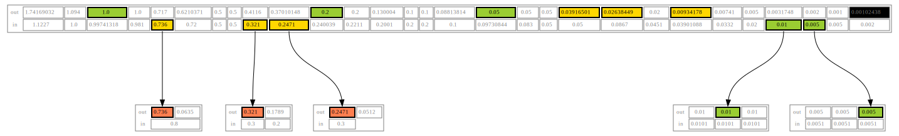
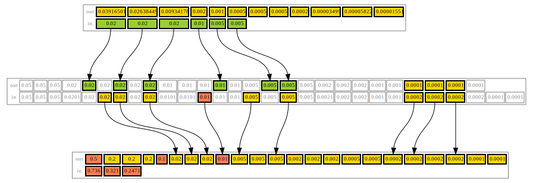

# Notes

-   These example are meant to illustrate how WabiSabi can be used as a building blocks and consequences/trade-offs of applying it in various ways, not all examples are desirable. Costs for privacy mostly reduce as the examples progress.
-   A single user's outputs are highlighted in various example transaction graphs.
-   Time flows up and arrows from inputs point at previous outputs in line with Satoshi's true original vision.
-   To keep illustrated CoinJoin transactions to a reasonable size most examples have 3 participants and arbitrary input and output amount registrations are always allowed (no coordinator enforced anonymity set). Previous mixes are always simplified to an equal amount CoinJoin with 3 participants.
-   Denominations are based on 1-2-5 preferred value series (powers of 2 omitted for simplicity, but both should be used in practice).
-   Mining and coordinator fees are always add to 0.0001. In practice the dust limit should parameterize any rounding, and total fees would be a function of the amounts and the total weight, not a constant.
-   Coordinator fee outputs are only shown (with black background) when accounting for prepaid fees, otherwise the coordinator's fee output is omitted.
-   The anonymity set size of the user's output is loosely represented by color (red, yellow, green). This does not account for inherited anonymity sets, it's intended to emphasize relative change in privacy of including a specific input or output in a given context.
-   An output's anonymity set can degrade when spent if the input can be linked to sibling inputs whose previous outputs have a smaller anonymity set.

# Single Operation

These examples illustrate receiving and sweeping or remixing of a single
output. Standard denomination outputs, which are likely to have a larger
anonymity set, are created. Standard denominations may still need to be
subsequently remixed to ensure privacy since even if the coordinator enforces
\(k > 0\), that only applies to arbitrary denominations.

## Sweep and mix into standard denomination outputs

-   Sweep and mix amount close to standard denomination
    
    \( \{ 0.1001 \} \mapsto \{ 0.1 \} \)
    
    

-   Sweep and mix standard denomination amount with auxiliary input for fees
    
    \( \{ 0.1, 0.0001 \} \mapsto \{ 0.1 \} \)
    
    

-   Sweep and mix standard denomination amount, creating a mess of outputs
    
    \( \{ 0.1 \} \mapsto \{ 0.05, 0.02, 0.02, 0.005, 0.002, 0.002, 0.0005, 0.0002, 0.0002 \} \)
    
    

-   Sweep and mix arbitrary amount, creating a mess of outputs
    
    \( \{ 0.736 \} \mapsto \{ 0.5, 0.2, 0.02, 0.01, 0.005, 0.0005, 0.0002, 0.0002 \} \)
    
    

-   Sweep and mix arbitrary amount with auxiliary mixed outputs for rounding of created output
    
    \( \{ 0.736, 0.2, 0.05, 0.01, 0.002, 0.002, 0.0001 \} \mapsto \{ 1.0 \} \)
    
    

## Reduce block space requirement and UTXO set churn using optional fee credentials

By adding support for [prepaid fee credentials](https://github.com/zkSNACKs/WabiSabi/issues/18) small change outputs can be
suppressed, instead issuing prepaid fee credentials that can then be redeemed
in subsequent rounds in order to pay the required mining and coordinator fees
(the coordinator may need to include additional inputs to cover mining fees
in the event that participants' non-prepaid coordination fees can't cover the
mining fees).

-   Sweep and mix standard denomination utilizing prepaid fee credential to cover mining and coordination fees
    
    \( \{ 0.1, \underbrace{0.0001}_\mathrm{prepaid} \} \mapsto \{ 0.1 \} \)
    
    

-   Sweep and mix amount close to standard denomination, suppressing smaller outputs by prepaying fees
    
    \( \{ 0.1002 \} \mapsto \{ 0.1, \underbrace{0.0001}_\mathrm{prepaid} \} \)
    
    

-   Sweep and mix arbitrary amount, suppressing smaller outputs by prepaying fees credentials
    
    \( \{ 0.736 \} \mapsto \{ 0.5, 0.2, 0.02, 0.01, 0.005, \underbrace{0.0009}_\mathrm{prepaid} \} \)
    
    

-   Sweep and mix arbitrary amount with auxiliary mixed outputs in order to create rounded amount, suppressing smaller outputs by prepaying fees
    
    \( \{ 0.736, 0.2, 0.05, 0.01, 0.005 \} \mapsto \{ 1.0, \underbrace{0.0009}_\mathrm{prepaid} \} \)
    
    

-   Sweep and mix arbitrary amount with auxiliary mixed outputs in order to create rounded amount, covering fees with prepaid credential
    
    \( \{ 0.736, 0.2, 0.05, 0.01, 0.002, 0.002, \underbrace{0.0001}_\mathrm{prepaid} \} \mapsto \{ 1.0 \} \)
    
    

## Spend mixed standard denomination outputs to make arbitrary amount payments

-   Spend using mixed output close to arbitrary payment amount creating toxic change
    
    Note that the anonymity set of the input is not degraded, the payment can't
    be traced to a specific previous output, but the change and payment are
    linkable, and the payment itself is known to the receiver, but strictly
    speaking the anonymity set of this pair of outputs is still 3.
    
    \( \{ 0.01 \} \mapsto \{ 0.00934178, 0.00055822 \} \)
    
    

-   Spend using mixed output close to payment amount creating standard denomination change and suppressing dust change by prepaying fees
    
    \( \{ 0.01 \} \mapsto \{ 0.00934178, 0.0005, \underbrace{0.00005822}_\mathrm{prepaid} \} \)
    
    

-   Spend using mixed output larger than payment amount creating multiple standard denomination changes and suppressing dust by prepaying fees
    
    In this example the payment can't be linked to any specific sibling output
    or any specific funding input, so it is considered more private than
    before. Note however that the input only has one sibling input, so payment
    privacy relies more on the inherited anonymity set from the previous mix
    than the sibling inputs.
    
    \( \{ 0.1 \} \mapsto \{ 0.00934178, 0.05, 0.02, 0.02, \underbrace{0.00055822}_\mathrm{prepaid} \} \)
    
    

# Batched Operations

Batching operations can cut through the need for intermediate standard
denomination outputs significantly saving on fees. However, to maintain
privacy this depends on other users to provide cover by registering their own
inputs or outputs of plausibly related amounts. To ensure that individual
outputs spent or created in a batch can't be linked the wallet may need to
fall back to performing operations separately, incurring higher fees,
depending on the coordinator's minimum anonymity set policy and/or the
announced denominations. The coordinator can enforce privacy by setting the
round parameter \(k\) to some minimum value, ensuring that arbitrary amount
registrations may only be made adjacent to standard denomination inputs and
outputs that provide cover.

-   Batched sweep and mix consolidating several arbitrary amount inputs
    
    Although the swept inputs are not deterministically linkable, but privacy
    is marginal.
    
    \( \{ 0.736, 0.321 \} \mapsto \{ 1.0, 0.05, 0.005, 0.001, 0.0005, 0.0002, 0.0002 \} \)
    
    

-   Batched sweep and mix several arbitrary amounts suppressing smaller outputs
    
    \( \{ 0.736, 0.321 \} \mapsto \{ 1.0, 0.05, 0.005, 0.001, \underbrace{0.0009}_\mathrm{prepaid} \} \)
    
    

-   Batched sweep and mix several arbitrary amounts and standard denominations to produce standard denomination
    
    \( \{ 0.736, 0.2471, 0.01, 0.005, 0.002 \} \mapsto \{ 1.0 \} \)
    
    

-   Same as previous example, but with more participants reducing linkability of user's individual inputs
    
    \( \{ 0.736, 0.2471, 0.01, 0.005, 0.002 \} \mapsto \{ 1.0 \} \)
    
    

-   Batched payments using mixed output larger than total payment amount creating multiple standard denomination changes and suppressing dust by prepaying fees
    
    \( \{ 0.1 \} \mapsto \{ 0.03916501, 0.02638449, 0.00934178, 0.02, 0.005, \underbrace{0.00000872}_{\mathrm{prepaid}} \} \)
    
    

-   Combined sweeping and payments suppressing small outputs with prepaid fee credentials
    
    \( \{ 0.736, 0.321, 0.2471, 0.02, 0.001 \} \mapsto \{ 0.03916501, 0.02638449, 0.00934178, 1.0, 0.2, 0.05, \underbrace{0.00010872}_\mathrm{prepaid} \} \)
    
    

-   Same as previous example but with more participants
    
    This can be thought of as the first example of a proper radix knapsack
    CoinJoin in this document, since every arbitrary amount is supported by a at
    least two inputs or outputs for each standard denomination which would be
    used in its decomposition.
    
    \( \{ 0.736, 0.321, 0.2471, 0.02, 0.001 \} \mapsto \{ 0.03916501, 0.02638449, 0.00934178, 1.0, 0.2, 0.05, \underbrace{0.00010872}_\mathrm{prepaid} \} \)
    
    

-   Unbatched Split, Mix, Spend
    
    This example is primarily to motivate the previous two, and reflects the
    kind of mixing that may be required to handle arbitrary amounts. If other
    participants in CoinJoin transactions where funds are swept do not provide
    denominations providing sufficient unlinkability between the input and
    outputs, or the transactions were not CoinJoins at all (as illustrated here)
    then standard denomination outputs will not have a sufficient anonymity set
    to be used for payments without mixing first.
    
    Note the complications introduced by ensuring that inputs used for fees do
    not reveal linking information, this could be done more efficiently by
    paying the fees using already mixed outputs or prepaid fee credentials.
    
    \( \{ 0.736 \} \mapsto \{ 0.5, 0.2, 0.02, 0.01, 0.005, 0.0005, 0.0002, 0.0002 \} \)
    
    \( \{ 0.321 \} \mapsto \{ 0.2, 0.1, 0.02, 0.0005, 0.0002, 0.0002 \} \)
    
    \( \{ 0.2471 \} \mapsto \{ 0.2, 0.02, 0.02, 0.005, 0.002 \} \)
    
    \( \{ 0.005, 0.005 \} \mapsto \{ 0.00934178, 0.00055822 \} \)
    
    \( \{ 0.02, 0.02 \} \mapsto \{ 0.03916501, 0.00073499 \} \)
    
    \( \{ 0.02, 0.01 \} \mapsto \{ 0.02638449, 0.00351551 \} \)
    
    

-   Batched Split Mix, Spend in separate steps
    
    This is example is somewhere in between the last two, where the individual
    operations are combined into CoinJoin transactions, with no other
    participants in the sweep and the spend transactions. Although there no
    other participants the user's operations are not linked since consolidation
    is avoided (resulting in the same UTXO set bloat as the previous example),
    requiring 3 distinct steps instead of allowing all operations being included
    in just a single transaction. Note that unlike the previous examples the
    user pays 0.0003 in combined fees in each transaction, simulating 3 users
    (as opposed to say 0.0001, which would be a privacy concern). In a realistic
    scenario this would not be the case since the number of users does not play
    any part in the calculations, see below.
    
    \( \{ 0.736, 0.321, 0.2471 \} \mapsto \{ 0.5, 0.2, 0.02, 0.01, 0.005, 0.0005, 0.0002, 0.0002, 0.2, 0.1, 0.02, 0.0005, 0.0002, 0.0002, 0.2, 0.02, 0.02, 0.005, 0.002 \} \)
    
    \( \{ 0.02, 0.02, 0.02, 0.01, 0.005, 0.005 \} \mapsto \{ 0.00934178, 0.0005, 0.00005822, 0.03916501, 0.0005, 0.0002, 0.00003499, 0.02638449, 0.002, 0.001, 0.0005, 0.00001551 \} \)
    
    

# Additional Notes

## Powers of 2

Using only powers of 2 or only a 1-2-5 series can result in some suboptimal
decompositions of amounts, e.g. the digits 8 and 9 each require 3 standard
denominations (5+2+1, 5+2+2), and subtracting a small amount from a power of
two requires many small outputs to be created as change.

This can be somewhat alleviated by utilizing both depending on the
representation called for by arbitrary amounts. Amounts with a bitcoin unit
bias will likely favor 1-2-5, but amounts relating to fiat prices will often
be more efficiently represented as binary. In particular auxiliary inputs of
either kind can be used such that the total amount taken back as change from
an arbitrary operation approaches a standard denomination value. This is
potentially useful since amounts typically have a low hamming weight in one
base, but not both, and outputs of either kind may be on hand depending on a
user's preferences. Excess precision from price conversions can be alleviated
with prepaid fee tokens or simply by rounding amounts as appropriate.

<table border="2" cellspacing="0" cellpadding="6" rules="groups" frame="hsides">

<colgroup>
<col  class="org-right" />

<col  class="org-right" />

<col  class="org-right" />

<col  class="org-left" />
</colgroup>
<thead>
<tr>
<th scope="col" class="org-right">sats</th>
<th scope="col" class="org-right">btc</th>
<th scope="col" class="org-right">bits in little endian order</th>
<th scope="col" class="org-left">notes</th>
</tr>
</thead>

<tbody>
<tr>
<td class="org-right">1</td>
<td class="org-right">1e-08</td>
<td class="org-right">1</td>
<td class="org-left">&#xa0;</td>
</tr>

<tr>
<td class="org-right">2</td>
<td class="org-right">2e-08</td>
<td class="org-right">01</td>
<td class="org-left">&#xa0;</td>
</tr>

<tr>
<td class="org-right">4</td>
<td class="org-right">4e-08</td>
<td class="org-right">001</td>
<td class="org-left">&#xa0;</td>
</tr>

<tr>
<td class="org-right">5</td>
<td class="org-right">5e-08</td>
<td class="org-right">101</td>
<td class="org-left">&#xa0;</td>
</tr>

<tr>
<td class="org-right">8</td>
<td class="org-right">8e-08</td>
<td class="org-right">0001</td>
<td class="org-left">&#xa0;</td>
</tr>

<tr>
<td class="org-right">10</td>
<td class="org-right">1e-07</td>
<td class="org-right">0101</td>
<td class="org-left">&#xa0;</td>
</tr>

<tr>
<td class="org-right">16</td>
<td class="org-right">1.6e-07</td>
<td class="org-right">00001</td>
<td class="org-left">&#xa0;</td>
</tr>

<tr>
<td class="org-right">20</td>
<td class="org-right">2e-07</td>
<td class="org-right">00101</td>
<td class="org-left">&#xa0;</td>
</tr>

<tr>
<td class="org-right">32</td>
<td class="org-right">3.2e-07</td>
<td class="org-right">000001</td>
<td class="org-left">&#xa0;</td>
</tr>

<tr>
<td class="org-right">50</td>
<td class="org-right">5e-07</td>
<td class="org-right">010011</td>
<td class="org-left">&#xa0;</td>
</tr>

<tr>
<td class="org-right">64</td>
<td class="org-right">6.4e-07</td>
<td class="org-right">0000001</td>
<td class="org-left">&#xa0;</td>
</tr>

<tr>
<td class="org-right">100</td>
<td class="org-right">1e-06</td>
<td class="org-right">0010011</td>
<td class="org-left">&#xa0;</td>
</tr>

<tr>
<td class="org-right">128</td>
<td class="org-right">1.28e-06</td>
<td class="org-right">00000001</td>
<td class="org-left">&#xa0;</td>
</tr>

<tr>
<td class="org-right">200</td>
<td class="org-right">2e-06</td>
<td class="org-right">00010011</td>
<td class="org-left">&#xa0;</td>
</tr>

<tr>
<td class="org-right">256</td>
<td class="org-right">2.56e-06</td>
<td class="org-right">000000001</td>
<td class="org-left">&#xa0;</td>
</tr>

<tr>
<td class="org-right">500</td>
<td class="org-right">5e-06</td>
<td class="org-right">001011111</td>
<td class="org-left">&#xa0;</td>
</tr>

<tr>
<td class="org-right">512</td>
<td class="org-right">5.12e-06</td>
<td class="org-right">0000000001</td>
<td class="org-left">&#xa0;</td>
</tr>

<tr>
<td class="org-right">1000</td>
<td class="org-right">1e-05</td>
<td class="org-right">0001011111</td>
<td class="org-left">smallest practical denomination (larger than dust limit)</td>
</tr>

<tr>
<td class="org-right">1024</td>
<td class="org-right">1.024e-05</td>
<td class="org-right">00000000001</td>
<td class="org-left">&#xa0;</td>
</tr>

<tr>
<td class="org-right">2000</td>
<td class="org-right">2e-05</td>
<td class="org-right">00001011111</td>
<td class="org-left">&#xa0;</td>
</tr>

<tr>
<td class="org-right">2048</td>
<td class="org-right">2.048e-05</td>
<td class="org-right">000000000001</td>
<td class="org-left">&#xa0;</td>
</tr>

<tr>
<td class="org-right">4096</td>
<td class="org-right">4.096e-05</td>
<td class="org-right">0000000000001</td>
<td class="org-left">&#xa0;</td>
</tr>

<tr>
<td class="org-right">5000</td>
<td class="org-right">5e-05</td>
<td class="org-right">0001000111001</td>
<td class="org-left">&#xa0;</td>
</tr>

<tr>
<td class="org-right">8192</td>
<td class="org-right">8.192e-05</td>
<td class="org-right">00000000000001</td>
<td class="org-left">&#xa0;</td>
</tr>

<tr>
<td class="org-right">10000</td>
<td class="org-right">0.0001</td>
<td class="org-right">00001000111001</td>
</tr>

<tr>
<td class="org-right">16384</td>
<td class="org-right">0.00016384</td>
<td class="org-right">000000000000001</td>
<td class="org-left">smallest reasonable denomination?</td>
</tr>

<tr>
<td class="org-right">20000</td>
<td class="org-right">0.0002</td>
<td class="org-right">000001000111001</td>
<td class="org-left">&#xa0;</td>
</tr>

<tr>
<td class="org-right">32768</td>
<td class="org-right">0.00032768</td>
<td class="org-right">0000000000000001</td>
<td class="org-left">&#xa0;</td>
</tr>

<tr>
<td class="org-right">50000</td>
<td class="org-right">0.0005</td>
<td class="org-right">0000101011000011</td>
<td class="org-left">&#xa0;</td>
</tr>

<tr>
<td class="org-right">65536</td>
<td class="org-right">0.00065536</td>
<td class="org-right">00000000000000001</td>
<td class="org-left">&#xa0;</td>
</tr>

<tr>
<td class="org-right">100000</td>
<td class="org-right">0.001</td>
<td class="org-right">00000101011000011</td>
<td class="org-left">&#xa0;</td>
</tr>

<tr>
<td class="org-right">131072</td>
<td class="org-right">0.00131072</td>
<td class="org-right">000000000000000001</td>
<td class="org-left">&#xa0;</td>
</tr>

<tr>
<td class="org-right">200000</td>
<td class="org-right">0.002</td>
<td class="org-right">000000101011000011</td>
<td class="org-left">&#xa0;</td>
</tr>

<tr>
<td class="org-right">262144</td>
<td class="org-right">0.00262144</td>
<td class="org-right">0000000000000000001</td>
<td class="org-left">&#xa0;</td>
</tr>

<tr>
<td class="org-right">500000</td>
<td class="org-right">0.005</td>
<td class="org-right">0000010010000101111</td>
<td class="org-left">&#xa0;</td>
</tr>

<tr>
<td class="org-right">524288</td>
<td class="org-right">0.00524288</td>
<td class="org-right">00000000000000000001</td>
<td class="org-left">&#xa0;</td>
</tr>

<tr>
<td class="org-right">1000000</td>
<td class="org-right">0.01</td>
<td class="org-right">00000010010000101111</td>
<td class="org-left">&#xa0;</td>
</tr>

<tr>
<td class="org-right">1048576</td>
<td class="org-right">0.01048576</td>
<td class="org-right">000000000000000000001</td>
<td class="org-left">&#xa0;</td>
</tr>

<tr>
<td class="org-right">2000000</td>
<td class="org-right">0.02</td>
<td class="org-right">000000010010000101111</td>
<td class="org-left">&#xa0;</td>
</tr>

<tr>
<td class="org-right">2097152</td>
<td class="org-right">0.02097152</td>
<td class="org-right">0000000000000000000001</td>
<td class="org-left">&#xa0;</td>
</tr>

<tr>
<td class="org-right">4194304</td>
<td class="org-right">0.04194304</td>
<td class="org-right">00000000000000000000001</td>
<td class="org-left">&#xa0;</td>
</tr>

<tr>
<td class="org-right">5000000</td>
<td class="org-right">0.05</td>
<td class="org-right">00000010110100100011001</td>
<td class="org-left">&#xa0;</td>
</tr>

<tr>
<td class="org-right">8388608</td>
<td class="org-right">0.08388608</td>
<td class="org-right">000000000000000000000001</td>
<td class="org-left">&#xa0;</td>
</tr>

<tr>
<td class="org-right">10000000</td>
<td class="org-right">0.1</td>
<td class="org-right">000000010110100100011001</td>
<td class="org-left">&#xa0;</td>
</tr>

<tr>
<td class="org-right">16777216</td>
<td class="org-right">0.16777216</td>
<td class="org-right">0000000000000000000000001</td>
<td class="org-left">&#xa0;</td>
</tr>

<tr>
<td class="org-right">20000000</td>
<td class="org-right">0.2</td>
<td class="org-right">0000000010110100100011001</td>
<td class="org-left">&#xa0;</td>
</tr>

<tr>
<td class="org-right">33554432</td>
<td class="org-right">0.33554432</td>
<td class="org-right">00000000000000000000000001</td>
<td class="org-left">&#xa0;</td>
</tr>

<tr>
<td class="org-right">50000000</td>
<td class="org-right">0.5</td>
<td class="org-right">00000001000011110101111101</td>
<td class="org-left">&#xa0;</td>
</tr>

<tr>
<td class="org-right">67108864</td>
<td class="org-right">0.67108864</td>
<td class="org-right">000000000000000000000000001</td>
<td class="org-left">&#xa0;</td>
</tr>

<tr>
<td class="org-right">100000000</td>
<td class="org-right">1</td>
<td class="org-right">000000001000011110101111101</td>
<td class="org-left">&#xa0;</td>
</tr>

<tr>
<td class="org-right">134217728</td>
<td class="org-right">1.34217728</td>
<td class="org-right">0000000000000000000000000001</td>
<td class="org-left">&#xa0;</td>
</tr>

<tr>
<td class="org-right">200000000</td>
<td class="org-right">2</td>
<td class="org-right">0000000001000011110101111101</td>
<td class="org-left">&#xa0;</td>
</tr>

<tr>
<td class="org-right">268435456</td>
<td class="org-right">2.68435456</td>
<td class="org-right">00000000000000000000000000001</td>
<td class="org-left">&#xa0;</td>
</tr>

<tr>
<td class="org-right">500000000</td>
<td class="org-right">5</td>
<td class="org-right">00000000101001101011001110111</td>
<td class="org-left">&#xa0;</td>
</tr>

<tr>
<td class="org-right">536870912</td>
<td class="org-right">5.36870912</td>
<td class="org-right">000000000000000000000000000001</td>
<td class="org-left">&#xa0;</td>
</tr>

<tr>
<td class="org-right">1000000000</td>
<td class="org-right">10</td>
<td class="org-right">000000000101001101011001110111</td>
<td class="org-left">&#xa0;</td>
</tr>

<tr>
<td class="org-right">1073741824</td>
<td class="org-right">10.73741824</td>
<td class="org-right">0000000000000000000000000000001</td>
<td class="org-left">&#xa0;</td>
</tr>

<tr>
<td class="org-right">2000000000</td>
<td class="org-right">20</td>
<td class="org-right">0000000000101001101011001110111</td>
<td class="org-left">&#xa0;</td>
</tr>

<tr>
<td class="org-right">2147483648</td>
<td class="org-right">21.47483648</td>
<td class="org-right">00000000000000000000000000000001</td>
<td class="org-left">&#xa0;</td>
</tr>

<tr>
<td class="org-right">4294967296</td>
<td class="org-right">42.94967296</td>
<td class="org-right">000000000000000000000000000000001</td>
<td class="org-left">&#xa0;</td>
</tr>

<tr>
<td class="org-right">5000000000</td>
<td class="org-right">50</td>
<td class="org-right">000000000100111110100000010101001</td>
<td class="org-left">&#xa0;</td>
</tr>
</tbody>
</table>

### TODO estimate overhead for receiving/spending various amounts privately

-   various common "psychological" numbers
-   actual amounts used in some random blocks

calculate overheads:

-   joinmarket (depth?)
-   1-2-5 series
    -   samourai (0.01, 0.05, 0.5)
    -   wasabi (\(0.1+\delta\))
-   radix knapsack w/ both bases
    -   poor conditions
    -   favorable conditions
    -   favorable conditions and large batch size

## Realistic Fees

In the above examples fees were assumed to be 0.0001 per participant to keep
illustrations simpler. However, the coordinator does not know how many users
are participating. This means that mining fees and coordination fees have to
be calculated separately for each registration, requiring the credential
balance proof to account for the effective fees after any discounts.

Mining fees are a linear function of the block weight per registration. These
are deducted for input registrations and output registrations separately.

Coordination fees can be a linear function of the amount, i.e. some constant
term enforcing a minimum, and some scaling factor of the amount. These fees
can be deducted from either inputs or outputs.

